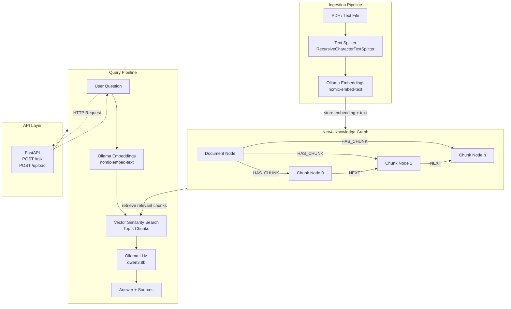

# PolicyMind

A Graph-RAG chatbot that lets you upload internal policy documents and ask natural language questions about them — such as *"What do I need to consider before launching a new vendor relationship?"*

Built with LangChain, Neo4j, Ollama, and FastAPI. React frontend coming soon.

---

## Why Graph-RAG?

Standard RAG retrieves isolated text chunks. PolicyMind uses a **knowledge graph** to capture relationships between policies, topics, and dependencies. This means answers are more complete — if Policy A references Policy B, the system understands that connection.

---

## Features

- Upload PDF or Markdown policy documents via API
- Automatic extraction of entities and relationships into Neo4j
- Natural language Q&A grounded in your documents
- Source citations for every answer
- Runs fully locally — no API key required
- Dynamic: swap in any document set without code changes

---

## How it works

1. Documents are ingested and split into chunks.
2. Each chunk is embedded using Ollama (`nomic-embed-text`) and stored as a node in Neo4j.
3. Chunks are linked sequentially via `NEXT` relationships and grouped under a `Document` node.
4. At query time, a vector similarity search retrieves the most relevant chunks.
5. The context is passed to a local LLM via Ollama (`qwen3:8b`), orchestrated by LangChain.
6. The model generates a grounded answer with references to the source documents.

---

## Architecture



## Tech Stack

| Layer | Technology |
|---|---|
| Orchestration | LangChain |
| Graph Database | Neo4j |
| Embeddings | Ollama (nomic-embed-text) |
| LLM | Ollama (qwen3:8b) |
| Backend API | FastAPI |
| Frontend | React (in progress) |

---

## Project Structure

```
policymind/
├── backend/
│   ├── api/          # FastAPI routes
│   ├── core/         # LangChain chains and RAG logic
│   ├── graph/        # Neo4j ingestion and query logic
│   └── models/       # Pydantic schemas
├── docs/             # Example policy documents
├── scripts/          # Ingestion and setup scripts
├── docker-compose.yml
└── README.md
```

---

## Getting Started

### Prerequisites

- Python 3.11+
- Docker and Docker Compose
- Ollama with `nomic-embed-text` and `qwen3:8b` pulled

```bash
ollama pull nomic-embed-text
ollama pull qwen3:8b
```

### Setup

```bash
git clone https://github.com/your-username/policymind.git
cd policymind

cp .env.example .env
# Edit .env and set your Neo4j password

docker compose up -d
pip install -r requirements.txt

PYTHONPATH=. python scripts/ingest.py --file docs/example_policy.pdf --name "Example Policy"
uvicorn backend.api.main:app --reload
```

### Example Query

```bash
curl -X POST http://localhost:8000/ask \
  -H "Content-Type: application/json" \
  -d '{"question": "What do I need to consider before onboarding a new vendor?"}'
```

```json
{
  "answer": "According to the Vendor Management Policy, you must complete a risk assessment, obtain approval from the procurement team, and ensure GDPR compliance before onboarding a new vendor.",
  "sources": ["vendor_management_policy.pdf", "data_privacy_guidelines.pdf"]
}
```

---

## Roadmap

### Core RAG System
- [x] Document ingestion pipeline (PDF / Text → Chunking → Neo4j storage)
- [x] Graph structure with sequential chunk linking (`NEXT` relationships)
- [x] Vector-based retrieval with Neo4j (embedding similarity search)
- [x] LLM-based question answering via RAG pipeline
- [ ] Upgrade to true Graph-RAG (relationship-aware retrieval + multi-hop traversal)
  - [ ] Use Neo4j relationships (e.g. `NEXT`, `RELATED`, `HAS_ENTITY`) during retrieval
  - [ ] Add graph-based context expansion after vector search
  - [ ] Implement hybrid retrieval (vector + graph traversal)
  - [ ] Add reranking of expanded context for better answer quality

### Backend API
- [ ] FastAPI Q&A endpoint (production-ready)
- [ ] Structured response format (answer + sources + context)
- [ ] Streaming responses for real-time output

### Frontend
- [ ] React frontend with document upload UI
- [ ] Chat interface for querying policies
- [ ] Source highlighting and traceable answers

### System Features
- [ ] Multi-tenant support
- [ ] Authentication and role-based access control
- [ ] Document versioning and updates

### Infrastructure
- [ ] Dockerized full-stack setup
- [ ] CI/CD pipeline
- [ ] Observability (logging and tracing for RAG pipeline)

---

## License

MIT